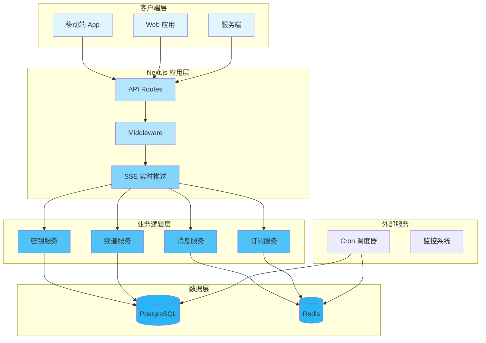
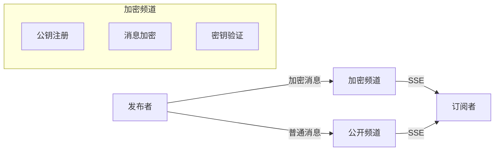
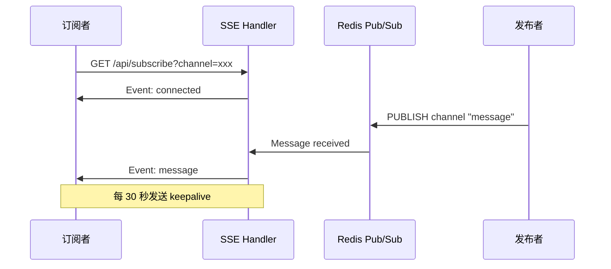
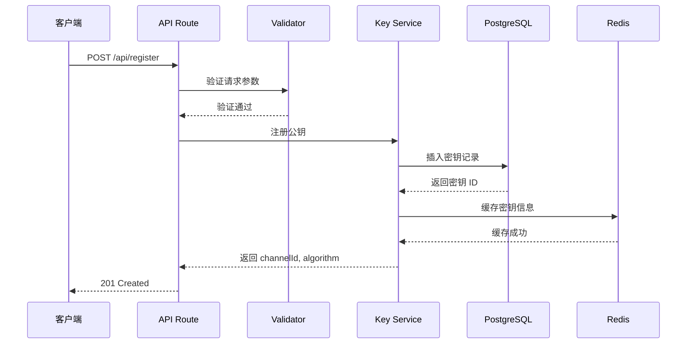
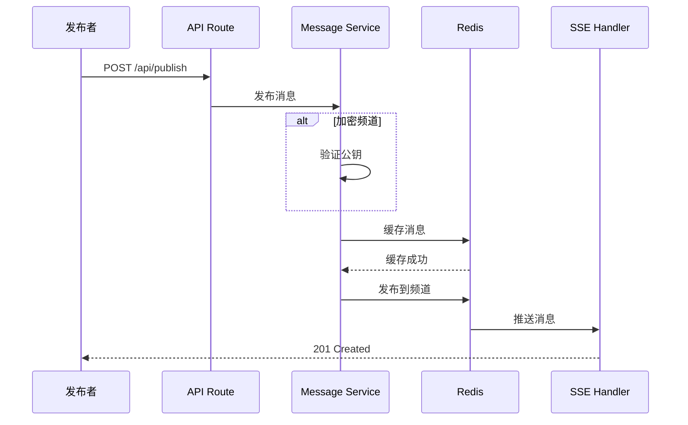
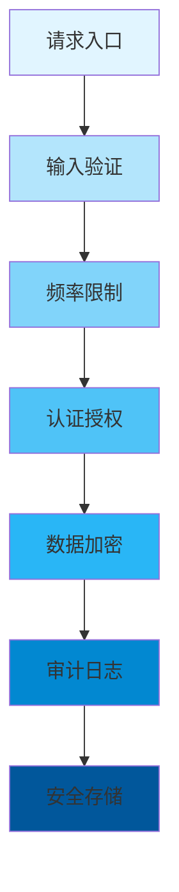
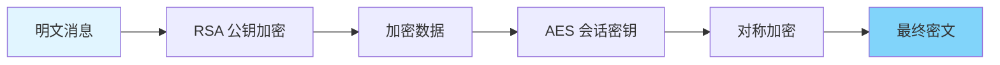
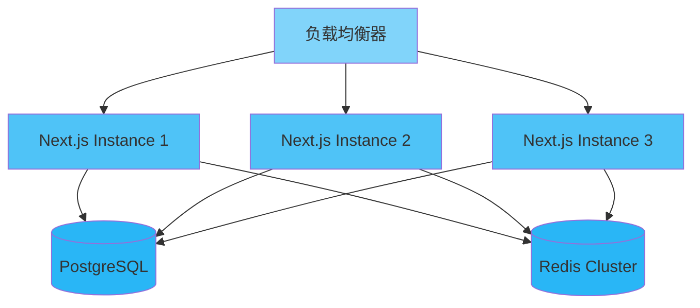

<div align="center">

# 🏗️ 架构设计

### subno.ts 技术架构与设计决策

[🏠 首页](../README.md) • [📖 用户指南](USER_GUIDE.md) • [📝 API 参考](API_REFERENCE.md)

---

</div>

## 📋 目录

- [概述](#概述)
- [系统架构](#系统架构)
- [组件设计](#组件设计)
- [数据流](#数据流)
- [设计决策](#设计决策)
- [技术栈](#技术栈)
- [性能优化](#性能优化)
- [安全架构](#安全架构)
- [可扩展性](#可扩展性)
- [未来改进](#未来改进)

---

## 概述

<div align="center">

### 🎯 架构目标

</div>

<table>
<tr>
<td width="25%" align="center">
<br>
<b>高性能</b><br>
低延迟、高吞吐量
</td>
<td width="25%" align="center">
<br>
<b>安全</b><br>
端到端加密、密钥管理
</td>
<td width="25%" align="center">
<br>
<b>模块化</b><br>
松耦合设计
</td>
<td width="25%" align="center">
<br>
<b>可维护</b><br>
清晰代码、完善文档
</td>
</tr>
</table>

### 设计原则

> 🎯 **简单优先**：保持 API 简洁直观
> 
> 🔒 **安全设计**：将安全融入每一层
> 
> ⚡ **性能优先**：针对常见情况进行优化
> 
> 🧩 **模块化**：组件独立且可组合

---

## 系统架构

<div align="center">

### 🏛️ 高层架构

</div>



### 技术选型

<table>
<tr>
<th>层级</th>
<th>技术</th>
<th>说明</th>
</tr>
<tr>
<td><b>运行时</b></td>
<td>Node.js 18+</td>
<td>Next.js 运行时环境</td>
</tr>
<tr>
<td><b>框架</b></td>
<td>Next.js 16</td>
<td>React 框架，App Router</td>
</tr>
<tr>
<td><b>数据库</b></td>
<td>PostgreSQL 14+</td>
<td>主数据存储</td>
</tr>
<tr>
<td><b>缓存</b></td>
<td>Redis 7+</td>
<td>消息队列、会话缓存</td>
</tr>
<tr>
<td><b>ORM</b></td>
<td>Drizzle ORM</td>
<td>类型安全数据库访问</td>
</tr>
<tr>
<td><b>验证</b></td>
<td>Zod</td>
<td>运行时数据验证</td>
</tr>
<tr>
<td><b>实时通信</b></td>
<td>Server-Sent Events</td>
<td>实时消息推送</td>
</tr>
</table>

---

## 组件设计

### 1️⃣ 密钥管理服务

<details open>
<summary><b>🔧 组件概述</b></summary>

密钥管理是 subno.ts 的核心组件，负责公钥的注册、存储、查询和撤销。

**核心职责：**
- 📌 验证公钥格式
- 📌 管理密钥生命周期
- 📌 支持多种加密算法
- 📌 处理密钥过期

**密钥类型：**

| 类型 | 说明 | 使用场景 |
|------|------|---------|
| `RSA-2048` | RSA 2048 位密钥 | 通用加密 |
| `RSA-4096` | RSA 4096 位密钥 | 高安全需求 |
| `ECC-SECP256K1` | 椭圆曲线密钥 | 轻量级场景 |

**代码结构：**

```
src/lib/services/
├── key.service.ts      # 密钥注册与查询
├── channel.service.ts  # 频道管理
├── message.service.ts  # 消息处理
└── subscription.service.ts  # 订阅管理
```

</details>

### 2️⃣ 频道管理

<div align="center">

#### 📡 频道类型

</div>



<table>
<tr>
<th>频道类型</th>
<th>加密</th>
<th>访问控制</th>
<th>有效期</th>
</tr>
<tr>
<td><b>公开频道</b></td>
<td>❌</td>
<td>公开</td>
<td>可配置</td>
</tr>
<tr>
<td><b>加密频道</b></td>
<td>✅</td>
<td>需密钥</td>
<td>固定 7 天</td>
</tr>
<tr>
<td><b>临时频道</b></td>
<td>❌</td>
<td>创建者</td>
<td>24 小时</td>
</tr>
</table>

### 3️⃣ 实时推送系统



**SSE 事件类型：**

| 事件类型 | 说明 | 数据格式 |
|---------|------|---------|
| `connected` | 连接确认 | 频道信息 |
| `message` | 消息推送 | 消息内容 |
| `error` | 错误通知 | 错误详情 |
| `keepalive` | 保活心跳 | 空数据 |

### 4️⃣ 数据访问层

```
src/lib/repositories/
├── key.repository.ts      # 密钥数据访问
├── channel.repository.ts  # 频道数据访问
├── message.repository.ts  # 消息数据访问
└── api-key.repository.ts  # API 密钥数据访问
```

**职责：**
- 📌 封装数据库操作
- 📌 实现缓存策略
- 📌 处理数据转换

---

## 数据流

<div align="center">

### 🔄 公钥注册流程

</div>



<div align="center">

### 📤 消息发布流程

</div>



---

## 设计决策

<div align="center">

### 🤔 决策背景与理由

</div>

### 决策 1：选择 Next.js + TypeScript

<table>
<tr>
<td width="50%">

**✅ 优势**
- 全栈能力
- 类型安全
- 丰富的生态系统
- SSR/SSG 支持
- Vercel 部署优化

</td>
<td width="50%">

**❌ 考量**
- 非纯后端框架
- 冷启动延迟

</td>
</tr>
</table>

**结论：** ✅ **选择 Next.js** - 适合快速开发全栈应用

---

### 决策 2：PostgreSQL + Redis 数据分层

```typescript
// 数据访问策略
const dataStrategy = {
  // 频繁读写，使用 Redis 缓存
  messages: {
    storage: 'redis',
    ttl: 86400,  // 24 小时
  },
  
  // 核心数据，使用 PostgreSQL
  keys: {
    storage: 'postgres',
    backup: true,
  },
  
  // 配置数据，PostgreSQL 存储
  channels: {
    storage: 'postgres',
    indexes: ['id', 'type', 'creator'],
  },
};
```

**分层策略：**

| 数据类型 | 存储 | 原因 |
|---------|------|------|
| 消息缓存 | Redis | 高频读写、低延迟 |
| 密钥记录 | PostgreSQL | 持久化、事务安全 |
| 审计日志 | PostgreSQL | 长期存储、查询 |
| 会话状态 | Redis | 快速访问 |

---

### 决策 3：使用 Zod 进行请求验证

<table>
<tr>
<td width="50%">

**❌ 传统方式**
```typescript
if (!data.publicKey) {
  throw new Error('publicKey required');
}
if (typeof data.expiresIn !== 'number') {
  throw new Error('expiresIn must be number');
}
```

</td>
<td width="50%">

**✅ Zod 方式**
```typescript
const schema = z.object({
  publicKey: z.string().min(1),
  algorithm: z.string().optional(),
  expiresIn: z.number().optional(),
});

const data = schema.parse(req.body);
```

</td>
</tr>
</table>

**优势：**
- 📌 类型推断
- 📌 可复用模式
- 📌 清晰的错误信息
- 📌 易于测试

---

### 决策 4：Server-Sent Events 实时推送

<table>
<tr>
<td width="33%" align="center">

**WebSocket**
- 双向通信
- 更复杂
- 需要额外服务

</td>
<td width="33%" align="center">

**SSE** ✅
- 单向推送
- 简单可靠
- 内置重连支持
- HTTP 兼容

</td>
<td width="33%" align="center">

**WebRTC**
- 点对点
- 最复杂
- 适合媒体流

</td>
</tr>
</table>

**选择 SSE 的理由：**
- 🔹 只需要服务器向客户端推送
- 🔹 使用标准 HTTP 协议
- 🔹 自动重连机制
- 🔹 浏览器原生支持

---

## 技术栈

<div align="center">

### 🛠️ 核心技术

</div>

<table>
<tr>
<th>类别</th>
<th>技术</th>
<th>版本</th>
<th>用途</th>
</tr>
<tr>
<td rowspan="2"><b>运行时</b></td>
<td>Node.js</td>
<td>18+</td>
<td>JavaScript 运行时</td>
</tr>
<tr>
<td>TypeScript</td>
<td>5.x</td>
<td>类型安全</td>
</tr>
<tr>
<td><b>框架</b></td>
<td>Next.js</td>
<td>16.1.1</td>
<td>React 全栈框架</td>
</tr>
<tr>
<td rowspan="2"><b>数据库</b></td>
<td>PostgreSQL</td>
<td>14+</td>
<td>主数据库</td>
</tr>
<tr>
<td>Redis</td>
<td>7+</td>
<td>缓存、消息队列</td>
</tr>
<tr>
<td><b>ORM</b></td>
<td>Drizzle ORM</td>
<td>最新</td>
<td>数据库访问层</td>
</tr>
<tr>
<td><b>验证</b></td>
<td>Zod</td>
<td>最新</td>
<td>运行时验证</td>
</tr>
<tr>
<td><b>测试</b></td>
<td>Vitest</td>
<td>最新</td>
<td>单元/集成测试</td>
</tr>
<tr>
<td><b>容器</b></td>
<td>Docker</td>
<td>最新</td>
<td>服务容器化</td>
</tr>
</table>

### 依赖关系

```mermaid
graph LR
    A[Next.js] --> B[React]
    A --> C[TypeScript]
    
    D[Drizzle ORM] --> E[PostgreSQL]
    
    F[Redis] --> G[ioredis]
    
    H[Vitest] --> I[@testing-library]
    
    J[Zod] --> K[TypeScript]
```

---

## 性能优化

<div align="center">

### ⚡ 性能优化策略

</div>

### 1️⃣ 数据库查询优化

```typescript
// ❌ N+1 查询问题
const channels = await db.query.channels.findMany();
for (const ch of channels) {
  const keys = await db.query.keys.findMany({
    where: eq(keys.channelId, ch.id),
  }); // 每条记录都会执行查询
}

// ✅ 使用关联查询
const channelsWithKeys = await db.query.channels.findMany({
  with: {
    keys: true,  // Drizzle 关联查询
  },
});
```

### 2️⃣ Redis 缓存策略

```typescript
// 缓存消息，减少数据库压力
async function getCachedMessages(channelId: string) {
  const cacheKey = `messages:${channelId}`;
  
  // 先查缓存
  const cached = await redis.get(cacheKey);
  if (cached) {
    return JSON.parse(cached);
  }
  
  // 缓存未命中，查数据库
  const messages = await db.query.messages.findMany({
    where: eq(messages.channelId, channelId),
    limit: 50,
  });
  
  // 写入缓存，10 分钟过期
  await redis.setex(cacheKey, 600, JSON.stringify(messages));
  
  return messages;
}
```

### 3️⃣ 连接池配置

```typescript
// drizzle.config.ts
export default {
  dialect: 'postgresql',
  dbCredentials: {
    url: process.env.DATABASE_URL,
  },
  pool: {
    min: 2,      // 最小连接数
    max: 10,     // 最大连接数
    idleTimeout: 30000,
  },
} satisfies Config;
```

### 性能指标

<table>
<tr>
<th>操作</th>
<th>目标延迟</th>
<th>目标吞吐量</th>
</tr>
<tr>
<td>公钥注册</td>
<td>&lt; 100ms</td>
<td>&gt; 1000 QPS</td>
</tr>
<tr>
<td>消息发布</td>
<td>&lt; 50ms</td>
<td>&gt; 5000 QPS</td>
</tr>
<tr>
<td>SSE 连接</td>
<td>&lt; 10ms</td>
<td>&gt; 10000 并发</td>
</tr>
</table>

---

## 安全架构

<div align="center">

### 🔒 深度防御策略

</div>



### 安全控制层

<table>
<tr>
<th>层级</th>
<th>控制措施</th>
<th>目的</th>
</tr>
<tr>
<td><b>1. 输入验证</b></td>
<td>Zod 模式验证</td>
<td>防止注入攻击</td>
</tr>
<tr>
<td><b>2. 频率限制</b></td>
<td>Redis 计数器</td>
<td>防止 DoS 攻击</td>
</tr>
<tr>
<td><b>3. 认证授权</b></td>
<td>API Key 验证</td>
<td>控制资源访问</td>
</tr>
<tr>
<td><b>4. 数据加密</b></td>
<td>公钥加密</td>
<td>保护消息机密性</td>
</tr>
<tr>
<td><b>5. 审计日志</b></td>
<td>操作记录</td>
<td>安全审计追溯</td>
</tr>
<tr>
<td><b>6. 安全存储</b></td>
<td>PostgreSQL 加密</td>
<td>保护存储数据</td>
</tr>
</table>

### 威胁模型

<details>
<summary><b>🎯 威胁与缓解措施</b></summary>

| 威胁 | 影响 | 缓解措施 | 状态 |
|------|------|---------|------|
| API Key 泄露 | 高 | 轮换机制、范围限制 | ✅ |
| 频率滥用 | 中 | 请求限流 | ✅ |
| 公钥伪造 | 高 | 格式验证 | ✅ |
| 消息篡改 | 高 | 签名验证 | 规划中 |
| 数据泄露 | 高 | 加密存储 | 规划中 |

</details>

### 加密流程



---

## 可扩展性

<div align="center">

### 📈 扩展策略

</div>

### 水平扩展



**关键点：**
- 🔹 无状态设计，易于横向扩展
- 🔹 共享数据库保证数据一致性
- 🔹 Redis 集群支持高可用

### 容量规划

<table>
<tr>
<th>资源</th>
<th>扩展策略</th>
<th>影响</th>
</tr>
<tr>
<td><b>应用实例</b></td>
<td>增加 Pod/Container</td>
<td>⬆️ 并发处理能力</td>
</tr>
<tr>
<td><b>数据库</b></td>
<td>读写分离、分库分表</td>
<td>⬆️ 查询性能</td>
</tr>
<tr>
<td><b>Redis</b></td>
<td>集群模式</td>
<td>⬆️ 缓存容量</td>
</tr>
</table>

---

## 未来改进

<div align="center">

### 🚀 规划中的功能

</div>

### 短期（1-3 个月）

- [ ] **消息签名**：使用私钥签名消息
- [ ] **密钥轮换**：自动轮换过期密钥
- [ ] **Webhook 通知**：HTTP 回调通知
- [ ] **消息加密**：端到端加密支持

### 中期（3-6 个月）

- [ ] **多租户支持**：隔离不同组织数据
- [ ] **数据分析**：消息统计与可视化
- [ ] **告警系统**：异常行为检测
- [ ] **性能监控**：Prometheus 指标

### 长期（6+ 个月）

- [ ] **WebSocket 支持**：双向实时通信
- [ **移动端 SDK**：iOS/Android 库
- [ ] **合规认证**：SOC2、ISO 27001
- [ ] **混合部署**：支持私有化部署

---

<div align="center">

**[📖 用户指南](USER_GUIDE.md)** • **[📝 API 参考](API_REFERENCE.md)** • **[🏠 首页](../README.md)**

由 Kirky.X 用 ❤️ 制作

[⬆ 返回顶部](#️-架构设计)

</div>
